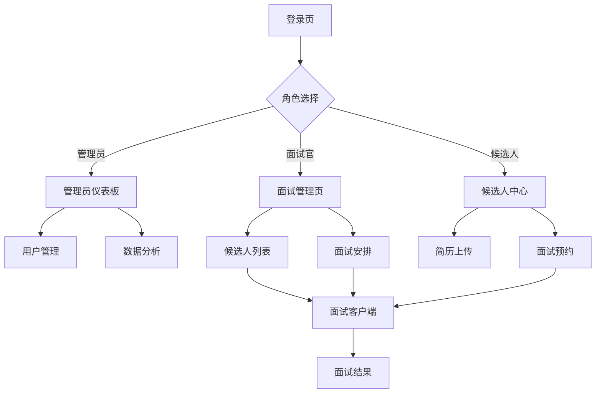

## 1. 产品概述
现代化面试管理系统，提供管理员仪表板和面试客户端功能。解决传统面试流程效率低、数据分散的问题，为HR团队提供智能化面试管理工具。

目标用户：HR管理员、面试官、候选人。通过数字化流程提升面试效率，实现数据驱动的招聘决策。

## 2. 核心功能

### 2.1 用户角色
| 角色 | 注册方式 | 核心权限 |
|------|----------|----------|
| 管理员 | 邮箱注册+后台审核 | 系统管理、数据分析、用户管理、面试流程配置 |
| 面试官 | 管理员邀请注册 | 查看候选人、进行面试、提交评价、查看面试历史 |
| 候选人 | 公开注册 | 提交简历、查看面试安排、参与视频面试、查看结果 |

### 2.2 功能模块
核心页面包括：
1. **登录注册页**：用户认证、角色选择、密码重置
2. **管理员仪表板**：数据概览、图表分析、用户管理、系统配置
3. **面试管理页**：候选人列表、面试安排、简历查看、评价记录
4. **面试客户端**：视频面试、实时评分、面试记录、结果提交
5. **候选人中心**：简历上传、面试预约、状态跟踪、历史记录

### 2.3 页面详情
| 页面名称 | 模块名称 | 功能描述 |
|----------|----------|----------|
| 登录注册页 | 用户登录 | 支持邮箱/手机号登录，记住密码，自动登录 |
| 登录注册页 | 用户注册 | 角色选择，信息验证，邮箱激活 |
| 登录注册页 | 密码重置 | 邮箱验证，安全重置，密码强度检测 |
| 管理员仪表板 | 数据概览 | 显示面试总数、候选人数量、通过率等关键指标 |
| 管理员仪表板 | 图表分析 | 月度面试趋势、部门招聘对比、面试官效率分析 |
| 管理员仪表板 | 用户管理 | 用户列表、权限分配、状态管理、批量操作 |
| 管理员仪表板 | 系统配置 | 面试流程设置、通知模板、系统参数配置 |
| 面试管理页 | 候选人列表 | 简历解析展示、搜索筛选、状态标记、批量导入 |
| 面试管理页 | 面试安排 | 时间预约、面试官分配、通知发送、日程同步 |
| 面试管理页 | 简历查看 | 智能解析、关键词高亮、技能匹配度评分 |
| 面试管理页 | 评价记录 | 面试官评价汇总、评分统计、意见收集 |
| 面试客户端 | 视频面试 | 高清视频通话、屏幕共享、录制功能、网络检测 |
| 面试客户端 | 实时评分 | 结构化评分表、实时记录、语音转文字 |
| 面试客户端 | 面试记录 | 历史记录查看、回放功能、评价编辑 |
| 面试客户端 | 结果提交 | 综合评价、录用建议、审批流程 |
| 候选人中心 | 简历上传 | 多种格式支持、智能解析、信息完善 |
| 候选人中心 | 面试预约 | 时间选择、时区适配、冲突检测 |
| 候选人中心 | 状态跟踪 | 实时状态更新、进度可视化、通知提醒 |
| 候选人中心 | 历史记录 | 面试历史、评价查看、成长轨迹 |

## 3. 核心流程

### 管理员流程
管理员登录系统后，首先进入仪表板查看整体数据概览和图表分析。可以进行用户管理，邀请面试官、管理候选人账号。配置面试流程和系统参数，监控整个招聘进程。

### 面试官流程
面试官接收管理员邀请注册账号，登录后查看分配的候选人列表。进行面试前可以预览候选人简历，面试过程中使用视频客户端进行实时评分和记录。面试结束后提交综合评价和建议。

### 候选人流程
候选人注册账号并上传简历，系统智能解析简历信息。接收面试邀请后选择合适的面试时间，参与视频面试，查看面试结果和反馈意见。

## 4. 用户界面设计

### 4.1 设计风格
- **主色调**：深蓝色(#1E3A8A)搭配白色背景，强调专业性和可信度
- **辅助色**：浅灰色(#F3F4F6)用于背景区分，绿色(#10B981)表示成功状态
- **按钮风格**：圆角矩形设计，主要按钮使用渐变色，悬停效果明显
- **字体规范**：主标题24px加粗，正文14px常规，小标签12px
- **布局风格**：左侧导航+右侧内容区，卡片式信息展示，响应式栅格系统
- **图标风格**：使用Element Plus图标库，线性图标为主，统一2px线宽

### 4.2 页面设计概述
| 页面名称 | 模块名称 | UI元素 |
|----------|----------|--------|
| 登录页 | 表单区域 | 居中卡片布局，宽度400px，背景渐变，圆角12px，阴影效果 |
| 仪表板 | 数据卡片 | 4列网格布局，卡片高度180px，图标+数字+描述，悬停上浮效果 |
| 仪表板 | 图表区域 | 卡片容器，标题栏+内容区，图表高度300px，支持全屏查看 |
| 候选人列表 | 表格展示 | 斑马纹行，操作按钮组，分页组件，批量操作栏 |
| 简历查看 | 信息卡片 | 左侧头像+基本信息，右侧详细信息分块展示，标签云展示技能 |
| 视频面试 | 视频区域 | 主视频占2/3区域，侧边栏显示候选人信息，底部控制栏 |
| 实时评分 | 评分面板 | 滑块评分组件，文本输入区，自动保存提示，提交确认 |

### 4.3 响应式设计
采用桌面端优先设计，适配1280px以上屏幕。平板端768px-1279px采用自适应布局，手机端低于768px使用专门的移动端布局。支持触摸操作优化，手势滑动切换页面，长按弹出菜单等交互。

### 4.4 交互动效
页面切换使用淡入淡出效果，时间300ms。数据加载显示骨架屏，操作反馈使用Toast提示。图表数据更新有平滑过渡动画。视频面试支持画中画模式，网络状态变化有实时提示。