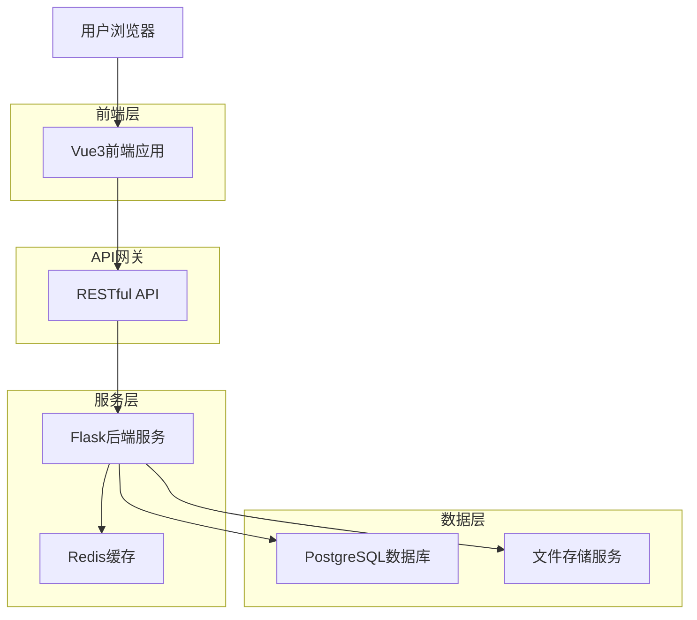
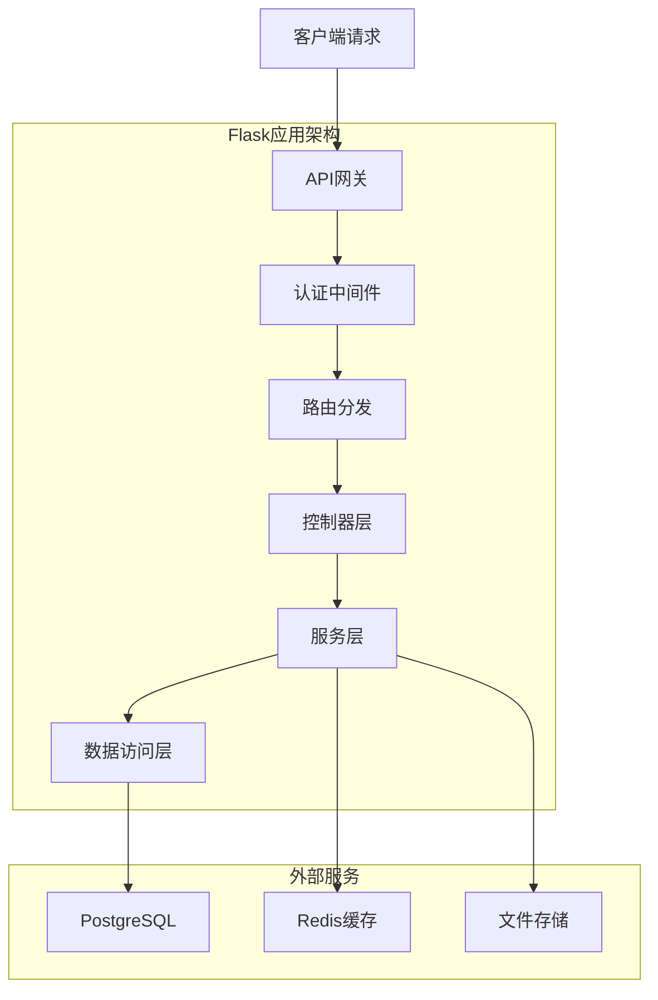
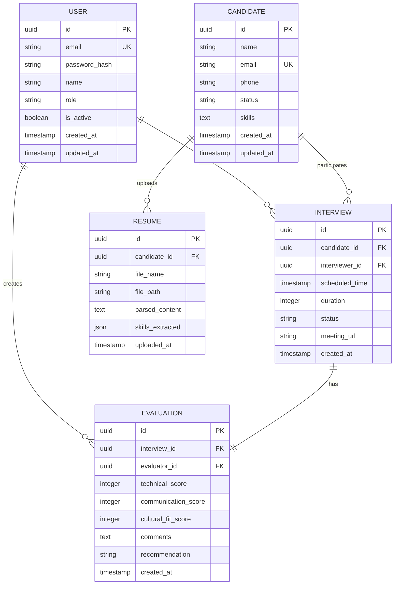

## 1. 架构设计



## 2. 技术栈描述

* **前端框架**: Vue3\@3.4 + Element Plus\@2.4 + Vite\@5.0

* **初始化工具**: vite-init

* **后端框架**: Flask\@2.3 + Python\@3.11

* **数据库**: PostgreSQL\@15 + SQLAlchemy\@2.0

* **缓存**: Redis\@7.2

* **文件存储**: MinIO\@latest

* **视频服务**: WebRTC + Socket.io

## 3. 路由定义

| 路由路径            | 页面用途            |
| --------------- | --------------- |
| /login          | 用户登录页面，支持多角色登录  |
| /register       | 用户注册页面，角色选择和验证  |
| /dashboard      | 管理员仪表板，数据概览和分析  |
| /interviews     | 面试管理页面，候选人列表和操作 |
| /interview/:id  | 面试详情页面，视频面试客户端  |
| /candidate      | 候选人中心，简历和面试管理   |
| /profile        | 用户个人中心，信息设置     |
| /admin/users    | 用户管理页面，仅限管理员    |
| /admin/settings | 系统设置页面，配置管理     |

## 4. API定义

### 4.1 认证相关API

**用户登录**

```
POST /api/auth/login
```

请求参数：

| 参数名      | 类型     | 必填 | 描述                                |
| -------- | ------ | -- | --------------------------------- |
| email    | string | 是  | 用户邮箱                              |
| password | string | 是  | 登录密码                              |
| role     | string | 是  | 用户角色(admin/interviewer/candidate) |

响应参数：

| 参数名            | 类型     | 描述      |
| -------------- | ------ | ------- |
| token          | string | JWT访问令牌 |
| refresh\_token | string | 刷新令牌    |
| user\_info     | object | 用户信息对象  |

请求示例：

```json
{
  "email": "admin@example.com",
  "password": "123456",
  "role": "admin"
}
```

**用户注册**

```
POST /api/auth/register
```

**令牌刷新**

```
POST /api/auth/refresh
```

### 4.2 面试管理API

**获取候选人列表**

```
GET /api/candidates
```

查询参数：

| 参数名     | 类型      | 必填 | 描述        |
| ------- | ------- | -- | --------- |
| page    | integer | 否  | 页码，默认1    |
| limit   | integer | 否  | 每页数量，默认20 |
| status  | string  | 否  | 候选人状态     |
| keyword | string  | 否  | 搜索关键词     |

**创建面试安排**

```
POST /api/interviews
```

**上传简历**

```
POST /api/candidates/:id/resume
```

**获取面试结果**

```
GET /api/interviews/:id/result
```

### 4.3 数据分析API

**仪表板统计数据**

```
GET /api/dashboard/stats
```

**面试趋势图表数据**

```
GET /api/dashboard/trends
```

**面试官效率分析**

```
GET /api/dashboard/efficiency
```

## 5. 服务器架构图



## 6. 数据模型

### 6.1 实体关系图



### 6.2 数据定义语言

**用户表 (users)**

```sql
-- 创建用户表
CREATE TABLE users (
    id UUID PRIMARY KEY DEFAULT gen_random_uuid(),
    email VARCHAR(255) UNIQUE NOT NULL,
    password_hash VARCHAR(255) NOT NULL,
    name VARCHAR(100) NOT NULL,
    role VARCHAR(20) NOT NULL CHECK (role IN ('admin', 'interviewer', 'candidate')),
    is_active BOOLEAN DEFAULT true,
    avatar_url VARCHAR(500),
    department VARCHAR(100),
    created_at TIMESTAMP WITH TIME ZONE DEFAULT NOW(),
    updated_at TIMESTAMP WITH TIME ZONE DEFAULT NOW()
);

-- 创建索引
CREATE INDEX idx_users_email ON users(email);
CREATE INDEX idx_users_role ON users(role);
CREATE INDEX idx_users_active ON users(is_active);
```

**候选人表 (candidates)**

```sql
-- 创建候选人表
CREATE TABLE candidates (
    id UUID PRIMARY KEY DEFAULT gen_random_uuid(),
    name VARCHAR(100) NOT NULL,
    email VARCHAR(255) UNIQUE NOT NULL,
    phone VARCHAR(20),
    status VARCHAR(20) DEFAULT 'pending' CHECK (status IN ('pending', 'scheduled', 'interviewed', 'hired', 'rejected')),
    skills TEXT,
    experience_years INTEGER,
    education VARCHAR(200),
    current_company VARCHAR(200),
    current_position VARCHAR(200),
    expected_salary DECIMAL(10,2),
    source VARCHAR(50),
    created_at TIMESTAMP WITH TIME ZONE DEFAULT NOW(),
    updated_at TIMESTAMP WITH TIME ZONE DEFAULT NOW()
);

-- 创建索引
CREATE INDEX idx_candidates_email ON candidates(email);
CREATE INDEX idx_candidates_status ON candidates(status);
CREATE INDEX idx_candidates_created ON candidates(created_at DESC);
```

**面试表 (interviews)**

```sql
-- 创建面试表
CREATE TABLE interviews (
    id UUID PRIMARY KEY DEFAULT gen_random_uuid(),
    candidate_id UUID NOT NULL REFERENCES candidates(id),
    interviewer_id UUID NOT NULL REFERENCES users(id),
    scheduled_time TIMESTAMP WITH TIME ZONE NOT NULL,
    actual_start_time TIMESTAMP WITH TIME ZONE,
    actual_end_time TIMESTAMP WITH TIME ZONE,
    duration INTEGER DEFAULT 60,
    status VARCHAR(20) DEFAULT 'scheduled' CHECK (status IN ('scheduled', 'in_progress', 'completed', 'cancelled')),
    meeting_url VARCHAR(500),
    meeting_id VARCHAR(100),
    room_password VARCHAR(50),
    notes TEXT,
    created_at TIMESTAMP WITH TIME ZONE DEFAULT NOW(),
    updated_at TIMESTAMP WITH TIME ZONE DEFAULT NOW()
);

-- 创建索引
CREATE INDEX idx_interviews_candidate ON interviews(candidate_id);
CREATE INDEX idx_interviews_interviewer ON interviews(interviewer_id);
CREATE INDEX idx_interviews_scheduled ON interviews(scheduled_time);
CREATE INDEX idx_interviews_status ON interviews(status);
```

**评价表 (evaluations)**

```sql
-- 创建评价表
CREATE TABLE evaluations (
    id UUID PRIMARY KEY DEFAULT gen_random_uuid(),
    interview_id UUID NOT NULL REFERENCES interviews(id),
    evaluator_id UUID NOT NULL REFERENCES users(id),
    technical_score INTEGER CHECK (technical_score >= 1 AND technical_score <= 10),
    communication_score INTEGER CHECK (communication_score >= 1 AND communication_score <= 10),
    problem_solving_score INTEGER CHECK (problem_solving_score >= 1 AND problem_solving_score <= 10),
    cultural_fit_score INTEGER CHECK (cultural_fit_score >= 1 AND cultural_fit_score <= 10),
    overall_score INTEGER GENERATED ALWAYS AS (
        (technical_score + communication_score + problem_solving_score + cultural_fit_score) / 4
    ) STORED,
    strengths TEXT,
    weaknesses TEXT,
    comments TEXT,
    recommendation VARCHAR(20) CHECK (recommendation IN ('strong_yes', 'yes', 'neutral', 'no', 'strong_no')),
    created_at TIMESTAMP WITH TIME ZONE DEFAULT NOW(),
    updated_at TIMESTAMP WITH TIME ZONE DEFAULT NOW()
);

-- 创建索引
CREATE INDEX idx_evaluations_interview ON evaluations(interview_id);
CREATE INDEX idx_evaluations_evaluator ON evaluations(evaluator_id);
CREATE INDEX idx_evaluations_overall ON evaluations(overall_score DESC);
```

**简历表 (resumes)**

```sql
-- 创建简历表
CREATE TABLE resumes (
    id UUID PRIMARY KEY DEFAULT gen_random_uuid(),
    candidate_id UUID NOT NULL REFERENCES candidates(id),
    file_name VARCHAR(255) NOT NULL,
    file_path VARCHAR(500) NOT NULL,
    file_size BIGINT,
    mime_type VARCHAR(100),
    parsed_content TEXT,
    skills_extracted JSONB,
    education_parsed JSONB,
    experience_parsed JSONB,
    is_parsed BOOLEAN DEFAULT false,
    uploaded_at TIMESTAMP WITH TIME ZONE DEFAULT NOW()
);

-- 创建索引
CREATE INDEX idx_resumes_candidate ON resumes(candidate_id);
CREATE INDEX idx_resumes_uploaded ON resumes(uploaded_at DESC);
```

### 6.3 初始数据

```sql
-- 插入默认管理员账户
INSERT INTO users (email, password_hash, name, role) VALUES 
('admin@example.com', '$2b$12$LQv3c1yqBWVHxkd0LHAkCOYz6TtxMQJqhN8/LewdBPj/RK.PJFu.', '系统管理员', 'admin');

-- 插入系统配置数据
INSERT INTO system_settings (key, value, description) VALUES
('interview_duration', '60', '默认面试时长（分钟）'),
('max_candidates_per_day', '8', '每天最大面试人数'),
('resume_parsing_enabled', 'true', '是否启用简历解析'),
('video_quality', 'hd', '视频通话质量设置');
```

