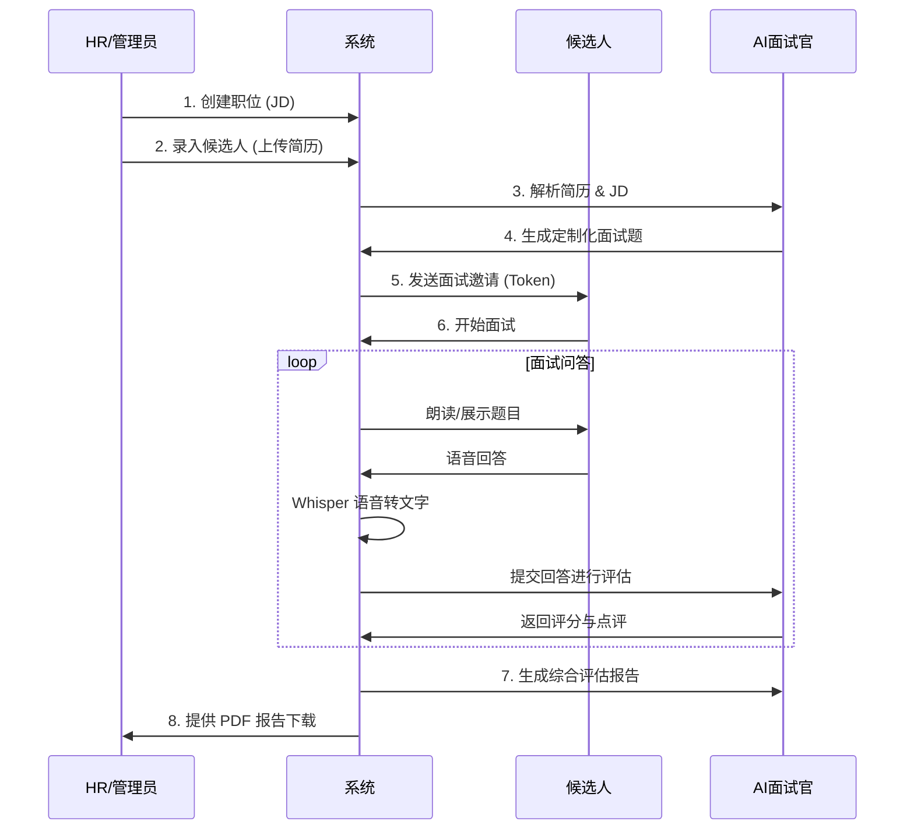
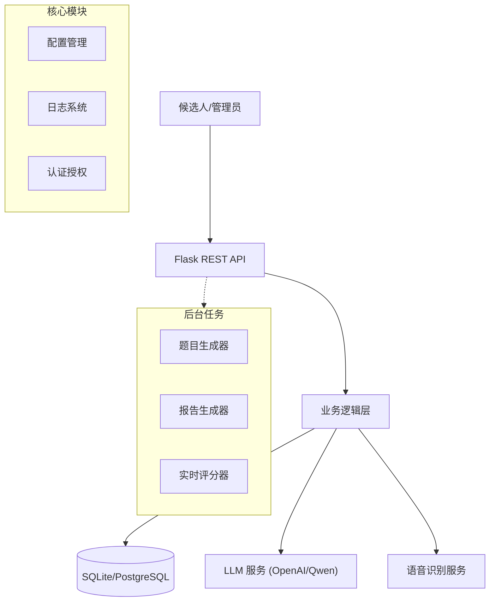

# AI智能面试系统 (AI Intelligent Interview System)


## 📖 项目介绍 (Introduction)

**AI智能面试系统** 是一款基于大语言模型（LLM）和语音识别技术的全流程自动化面试解决方案。旨在帮助企业降低招聘成本、提高面试效率，并为候选人提供公平、专业的面试体验。

系统覆盖了从职位发布、候选人管理、自动化生成面试题目、语音交互面试、实时评分到最终生成详细评估报告的全过程。

### ✨ 核心功能 (Core Features)

*   **智能出题**: 根据职位描述（JD）和候选人简历，利用 LLM 自动生成针对性的技术面试题。
*   **语音交互**: 集成 OpenAI Whisper 模型，支持候选人语音回答，提供真实的面试体验。
*   **实时评估**: AI 面试官对候选人的回答进行实时分析和打分，提供多维度的反馈。
*   **专业报告**: 面试结束后自动生成 PDF 评估报告，包含技术能力、沟通能力、综合素质等多维雷达图及录用建议。
*   **全流程管理**: 提供完善的后台管理系统，管理职位、候选人和面试流程。

## 📝 产品需求文档 (PRD)

### 1. 业务流程 (Business Flow)



### 2. 功能模块 (Functional Modules)

#### 2.1 职位管理 (Position Management)
*   **发布职位**: 录入职位名称、HC、岗位要求 (Requirements)、岗位职责 (Responsibilities)。
*   **职位列表**: 查看所有职位的招聘状态、负责人等信息。

#### 2.2 候选人管理 (Candidate Management)
*   **候选人录入**: 上传 PDF 简历，自动解析基础信息。
*   **关联职位**: 将候选人绑定到特定职位。
*   **简历解析**: 系统自动提取简历文本，用于后续生成问题。

#### 2.3 智能面试 (AI Interview)
*   **题目生成**: 调用 LLM，根据 `职位要求` + `简历内容` 生成 5-10 个技术/综合素质问题，并附带评分标准。
*   **语音交互**:
    *   **TTS (Text-to-Speech)**: 系统（可选）朗读题目。
    *   **ASR (Automatic Speech Recognition)**: 使用 Whisper 模型将候选人的语音回答转换为文本。
*   **实时评分**: 每个问题回答后，异步调用 AI 进行评分（0-100分）并给出点评。

#### 2.4 评估报告 (Evaluation Report)
*   **综合得分**: 计算技术、沟通、综合能力的加权得分。
*   **多维评价**: 生成优势 (Strengths)、劣势 (Weaknesses)、录用建议 (Hire/No Hire)。
*   **PDF 导出**: 自动生成排版精美的 PDF 报告，包含雷达图和详细评语。

---

## 💾 数据库设计 (Database Schema)

系统支持 SQLite 和 PostgreSQL，核心表结构如下：

### 1. 职位表 (`positions`)
| 字段名 | 类型 | 说明 |
| :--- | :--- | :--- |
| `id` | INTEGER/SERIAL | 主键 |
| `name` | TEXT | 职位名称 |
| `requirements` | TEXT | 岗位要求 (JD) |
| `responsibilities` | TEXT | 岗位职责 |
| `quantity` | INTEGER | 招聘人数 |
| `status` | TEXT | 状态 (招聘中/已结束) |
| `created_at` | INTEGER | 创建时间戳 |
| `recruiter` | TEXT | 招聘负责人 |

### 2. 候选人表 (`candidates`)
| 字段名 | 类型 | 说明 |
| :--- | :--- | :--- |
| `id` | INTEGER/SERIAL | 主键 |
| `position_id` | INTEGER | 关联职位 ID (FK) |
| `name` | TEXT | 姓名 |
| `email` | TEXT | 邮箱 |
| `resume_content` | BLOB | 简历文件内容 (PDF) |

### 3. 面试表 (`interviews`)
| 字段名 | 类型 | 说明 |
| :--- | :--- | :--- |
| `id` | INTEGER/SERIAL | 主键 |
| `candidate_id` | INTEGER | 关联候选人 ID (FK) |
| `interviewer` | TEXT | 面试官名称 (AI/人工) |
| `start_time` | INTEGER | 预计开始时间 |
| `status` | INTEGER | 0:未开始, 1:试题已备好, 2:进行中, 3:已完成, 4:报告已生成 |
| `token` | TEXT | 面试唯一访问令牌 |
| `report_path` | TEXT | 生成的 PDF 报告路径 |

### 4. 面试问题表 (`interview_questions`)
| 字段名 | 类型 | 说明 |
| :--- | :--- | :--- |
| `id` | INTEGER/SERIAL | 主键 |
| `interview_id` | INTEGER | 关联面试 ID (FK) |
| `question` | TEXT | 题目内容 |
| `score_standard` | TEXT | 评分标准 (JSON) |
| `answer_audio` | BLOB | 候选人语音回答 |
| `answer_text` | TEXT | 语音转写的文本 |
| `ai_score` | INTEGER | AI 评分 (0-100) |
| `ai_evaluation` | TEXT | AI 点评内容 |

---

## 🏗️ 系统架构 (Architecture)

系统采用分层架构设计，确保代码的可维护性和扩展性。



### 目录结构

```text
/root/project-interview/
├── app/                      # 核心应用包
│   ├── api/                  # API 接口 (Admin, Auth, Interview)
│   ├── core/                 # 核心配置 (Config, Database, Logger)
│   ├── services/             # 业务逻辑 (Report Service)
│   ├── utils/                # 工具函数
│   └── server.py             # 应用入口
├── scripts/                  # 运维与任务脚本
│   ├── generate_seed_data.py # 数据生成脚本
│   └── ...
├── data/                     # 数据存储 (DB, Resumes)
├── reports/                  # 生成的面试报告
├── tests/                    # 测试代码
└── README.md                 # 项目文档
```

## 🚀 快速开始 (Quick Start)

### 环境要求

*   Python 3.8+
*   FFmpeg (用于语音处理)
*   OpenAI API Key (或兼容的 API Key)

### 安装步骤

1.  **克隆仓库**
    ```bash
    git clone https://github.com/yourusername/ai-interview-system.git
    cd ai-interview-system
    ```

2.  **安装依赖**
    ```bash
    pip install -r requirements.txt
    ```

3.  **配置环境**
    复制 `.env.example` 为 `.env` 并填入配置：
    ```ini
    OPENAI_API_KEY=sk-xxxxxxxx
    OPENAI_BASE_URL=https://dashscope.aliyuncs.com/compatible-mode/v1
    SECRET_KEY=your-secret-key
    ```

4.  **初始化数据**
    ```bash
    # 生成测试数据（职位、候选人、简历）
    python scripts/generate_seed_data.py
    ```

5.  **启动服务**
    ```bash
    ./start.sh
    ```
    服务将运行在 `http://localhost:8000`。

## 🧪 测试与验证 (Testing)

运行端到端集成测试，验证完整业务流程：

```bash
python tests/test_flow.py
```

## 🗺️ 版本规划 (Roadmap)

### v1.0 MVP (Current)
- [x] **基础框架**: Flask 后端 + SQLite/PG 数据库适配。
- [x] **数据管理**: 职位与候选人 CRUD。
- [x] **智能出题**: 基于简历和 JD 生成面试题。
- [x] **语音面试**: 集成 Whisper 实现语音转文字。
- [x] **报告生成**: 基于 AI 评估生成 PDF 报告。

### v1.1 体验优化 (Next)
- [ ] **前端重构**: 开发 React/Vue 前端页面，替代当前的 API 交互模式。
- [ ] **实时反馈**: 优化语音识别延迟，实现流式对话体验。
- [ ] **多模型支持**: 适配 Claude, Llama 3 等更多开源/闭源模型。

### v2.0 智能化升级 (Future)
- [ ] **数字人面试官**: 集成 Live2D 或 3D 数字人，提供具象化的面试官形象，支持唇形同步。
- [ ] **视频分析**: 引入计算机视觉 (CV) 技术，分析候选人表情、眼神接触等非语言行为。
- [ ] **代码考核**: 集成在线 IDE，支持编程题实时运行和判题。
- [ ] **多语言支持**: 支持英文、日文等跨语言面试。

### v3.0 企业级特性 (Long-term)
- [ ] **微服务架构**: 将核心服务拆分为独立微服务 (Auth, Interview, Report)。
- [ ] **多租户支持**: 支持 SaaS 模式，服务多个企业客户。
- [ ] **数据分析看板**: 提供招聘漏斗、人才画像等数据可视化功能。

## 🤝 贡献指南 (Contributing)

欢迎提交 Issue 和 PR！请确保代码符合 PEP 8 规范，并包含适当的测试和注释。

## 📄 许可证 (License)

MIT License
