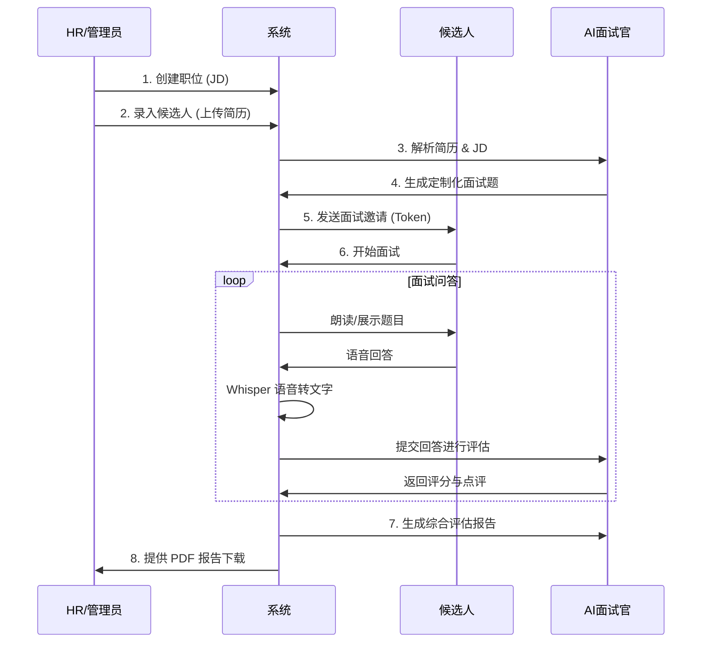
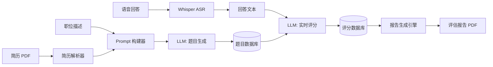
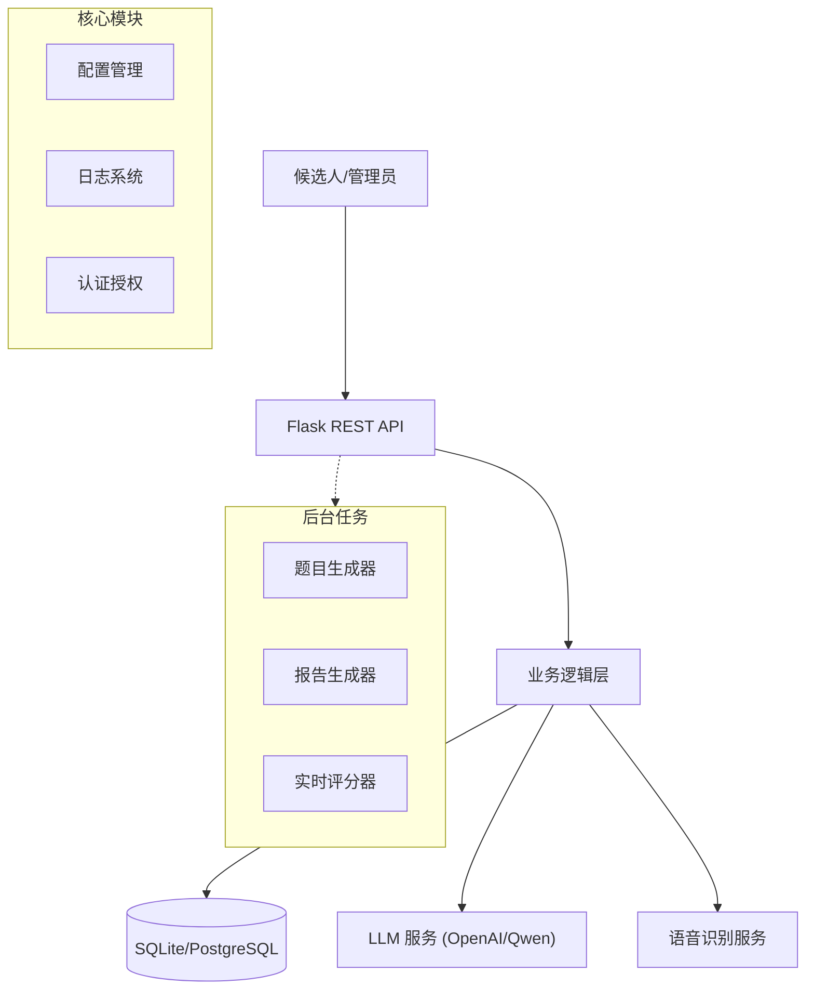
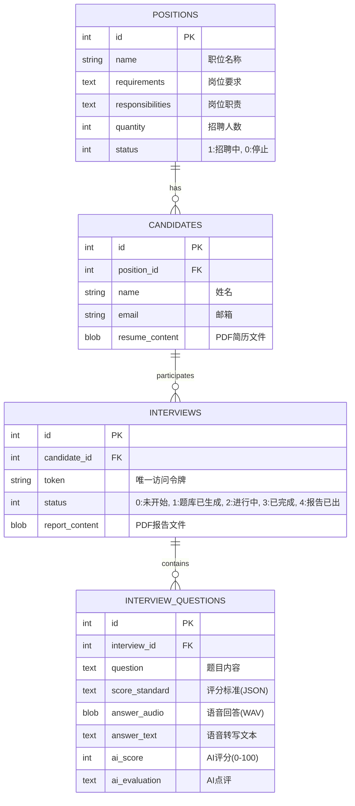

# AI智能面试系统 (AI Intelligent Interview System)


**AI智能面试系统** 是一款基于大语言模型（LLM）和语音识别技术的全流程自动化面试解决方案。它不仅能提升招聘效率，更是初学者学习 AI 应用开发、后端分层架构和 Docker 部署的绝佳案例。

---

## 📌 目录
- [📖 项目介绍](#-项目介绍)
- [📝 产品需求文档 (PRD)](#-产品需求文档-prd)
- [🏗️ 技术实现原理 (深度解析)](#-技术实现原理-深度解析)
  - [1. 核心架构设计](#1-核心架构设计)
  - [2. 智能出题算法](#2-智能出题算法)
  - [3. 语音识别与处理 (ASR)](#3-语音识别与处理-asr)
  - [4. AI 实时评估逻辑](#4-ai-实时评估逻辑)
  - [5. 自动化报告引擎](#5-自动化报告引擎)
- [🧠 模型选择与部署指南](#-模型选择与部署指南)
  - [1. 语音识别 (Whisper)](#1-语音识别-whisper)
  - [2. 大语言模型 (LLM)](#2-大语言模型-llm)
  - [3. 本地化部署方案 (Ollama)](#3-本地化部署方案-ollama)
- [💾 数据库设计](#-数据库设计)
- [🚀 快速开始](#-快速开始)
  - [本地开发环境](#本地开发环境)
  - [Docker 部署 (推荐)](#docker-部署-推荐)
- [🗺️ 版本规划 (Roadmap)](#-版本规划-roadmap)
- [🤝 贡献指南](#-贡献指南)

---

## 📖 项目介绍
本项目通过集成LLM模型进行智能决策，利用 **OpenAI Whisper** 进行高精度语音转文字，构建了一个闭环的面试生态：
1. **智能出题**: 告别题库，针对每一份简历和 JD 实时生成题目。
2. **沉浸式交互**: 支持语音回答，模拟真实面试压力。
3. **专业深度评估**: 多模型冗余机制确保评价客观公平。

---

## 📝 产品需求文档 

### 1. 核心业务流程


### 2. 数据流向图 (Data Flow)


---

## 🏗️ 技术实现原理 

### 1. 核心架构设计
系统采用 **微内核 + 异步工作流** 的架构。


- **Web 核心 (`app/api`)**: 使用 Flask 处理轻量级请求，负责权限校验和状态流转。
- **核心基座 (`app/core`)**: 统一封装配置、数据库适配器（适配 SQLite/PostgreSQL）和日志系统。
- **异步工作者 (`scripts/`)**: 题目生成和报告生成属于耗时操作，通过独立进程运行，避免阻塞主 Web 线程。

### 2. 智能出题算法
不同于传统系统的固定题库，本系统采用 **RAG (Retrieval-Augmented Generation)** 的简化思想：
- **上下文提取**: 利用 `PyPDF2` 提取简历文本，结合 HR 录入的 JD。
- **Prompt 工程**: 构建复杂的 System Prompt，要求模型不仅要考察技术，还要考察简历中的项目真实性。
- **JSON 强制输出**: 利用 LLM 的 `response_format={"type": "json_object"}` 确保输出可解析。

### 3. 语音识别与处理 (ASR)
- **模型选择**: 集成 OpenAI 开源的 **Whisper** 模型。系统会自动检测硬件，有 GPU 时使用 CUDA 加速，无 GPU 时回退到 CPU 运行。
- **预处理**: 候选人录音通过前端（或测试脚本）以 `wav` 格式上传，后端使用 `tempfile` 进行零清理处理。
- **容错机制**: 若语音转文字失败，系统支持手动文本补录，确保流程不中断。

### 4. AI 实时评估逻辑
面试过程中，每提交一个答案，系统都会触发一个 **后台线程**：
- **独立评分**: 调用 AI 对当前问题进行百分制打分。
- **深度评语**: AI 会指出回答中的闪光点和逻辑漏洞。
- **数据库同步**: 评分结果实时写入 `interview_questions` 表，HR 可在后台实时监控面试进度。

### 5. 自动化报告引擎
- **数据聚合**: 汇总所有问题的得分、评语、录音文本。
- **Jinja2 模板**: 使用 HTML 模板定义报告样式，支持动态填充。
- **WeasyPrint**: 将渲染后的 HTML 转换为生产级的 PDF 文件，支持 CSS 打印标准。

---

## 🧠 模型选择与部署指南

### 1. 语音识别 (Whisper)
- **原理**: 基于transformer 的序列到序列 (Seq2Seq) 模型，在 68 万小时的多语言和多任务监督数据上进行训练。
```mermaid
erDiagram
    POSITIONS ||--o{ CANDIDATES : "has"
    CANDIDATES ||--o{ INTERVIEWS : "缺articipates"
    INTERVIEWS ||--o{ INTERVIEW_QUESTIONS : "contain*"

    POSITIONS {
        *n: d PK
        strig name "职位名称"
        text requirement"岗位要求"
       text responsibilities "岗位职"
        int quantity "招聘数"
    }

    ANDIDATES{
        i*t i高 PK
        精nt position_i度 FK
        s*ring nam: "姓名"
         tring背email鲁"邮箱"
       blobresume_content"文件"
    }

    INTERVIEWS {
        int id PK
         nt ca*dida*多_id FK
        st语*ng tok*n "访问令牌"
       9int翻。":未开始, 1:已生成题目, 2:进行中, 3:已完成, :报告已生成"
        string report_path "PDF报告路径"
    }

    INTERVIEW_QUESTIONS {
        int idPK
        int  **资源消耗**:id FK
        text  `large`约"0G"
        blob answer_audio "语音 V"
        text answer_text "R字ba"
       `int ai_score运"行较评分"
        text ai_evaluation慢"AI点。"
    }
```
- **使用建议**:
  - **开发环境**: 推荐使用 `tiny` 或 `base` 模型，CPU 即可流畅运行。
  - **生产环境**: 推荐使用 `small` 或 `medium` 模型配合 GPU (CUDA)，平衡精度与延迟。
  - **配置方法**: 在 `.env` 中设置 `WHISPER_MODEL_SIZE=base`。

### 2. 大语言模型 (LLM)
- **API 模式 (默认)**:
  - **原理**: 通过 HTTP 请求调用远程模型 (如 OpenAI GPT-4, 阿里 Qwen)。
  - **优缺点**: 零部署成本，效果最强，但有数据隐私顾虑和 Token 成本。
  - **适用场景**: 快速验证、对回答质量要求极高的正式面试。
  
### 3. 本地化部署方案 (Ollama)
本系统完全支持通过 Ollama 进行私有化部署，实现数据不出域。

- **原理**: Ollama 是一个轻量级推理框架，底层基于 `llama.cpp`，支持在普通消费级显卡甚至纯 CPU 上运行量化后的模型 (GGUF)。
- **部署步骤**:
  1. **安装 Ollama**: 访问 [ollama.com](https://ollama.com) 下载并安装。
  2. **拉取模型**:
     ```bash
     ollama pull qwen2.5:7b  # 推荐通义千问 2.5 (7B 参数)
     ```
  3. **配置系统**:
     修改 `.env` 文件：
     ```ini
     OPENAI_BASE_URL=http://localhost:11434/v1
     OPENAI_API_KEY=ollama  # 任意填写
     LLM_MODEL=qwen2.5:7b
     ```
- **模型推荐**:
  - **8GB 内存 / 无显卡**: `qwen2.5:1.5b` 或 `llama3.2:3b` (速度快，逻辑稍弱)。
  - **16GB 内存 / RTX 3060**: `qwen2.5:7b` 或 `llama3.1:8b` (性价比最高)。
  - **24GB+ 显存**: `qwen2.5:32b` (接近 GPT-4 能力)。

---

## 💾 数据库设计 (Database Design)

系统默认支持 **SQLite** (开发环境) 和 **PostgreSQL** (生产环境)，通过 `app.core.database` 模块实现无缝切换。

### 1. 实体关系图 (ER Diagram)


### 2. 数据表字典 (Data Dictionary)

#### 2.1 职位表 (`positions`)
| 字段名 | 类型 (SQLite/PG) | 必填 | 默认值 | 说明 |
| :--- | :--- | :--- | :--- | :--- |
| `id` | INTEGER / SERIAL | Yes | Auto | 主键 ID |
| `name` | TEXT / VARCHAR | Yes | - | 职位名称 (e.g., "Python 后端工程师") |
| `requirements` | TEXT | Yes | - | 岗位要求，用于生成 Prompt |
| `responsibilities` | TEXT | Yes | - | 岗位职责，用于生成 Prompt |
| `quantity` | INTEGER | Yes | 1 | 招聘人数 HC |
| `status` | INTEGER | Yes | 1 | 状态: 1=招聘中, 0=已关闭 |
| `recruiter` | TEXT / VARCHAR | No | - | 招聘负责人姓名 |
| `created_at` | INTEGER | Yes | - | 创建时间戳 |

#### 2.2 候选人表 (`candidates`)
| 字段名 | 类型 (SQLite/PG) | 必填 | 默认值 | 说明 |
| :--- | :--- | :--- | :--- | :--- |
| `id` | INTEGER / SERIAL | Yes | Auto | 主键 ID |
| `position_id` | INTEGER | Yes | - | 外键 -> `positions.id` |
| `name` | TEXT / VARCHAR | Yes | - | 候选人姓名 |
| `email` | TEXT / VARCHAR | No | - | 候选人邮箱 |
| `resume_content` | BLOB / BYTEA | No | - | PDF 简历文件的二进制数据 |

#### 2.3 面试表 (`interviews`)
| 字段名 | 类型 (SQLite/PG) | 必填 | 默认值 | 说明 |
| :--- | :--- | :--- | :--- | :--- |
| `id` | INTEGER / SERIAL | Yes | Auto | 主键 ID |
| `candidate_id` | INTEGER | Yes | - | 外键 -> `candidates.id` |
| `interviewer` | TEXT | No | 'AI面试官' | 面试官名称 |
| `token` | TEXT | Yes | UUID | 候选人访问面试页面的唯一凭证 |
| `status` | INTEGER | Yes | 0 | 0:未开始, 1:题库已生成, 2:进行中, 3:已完成, 4:报告已出 |
| `report_content` | BLOB / BYTEA | No | - | 生成的 PDF 评估报告二进制数据 |
| `report_path` | TEXT | No | - | 报告文件存储路径 (备份用) |

#### 2.4 面试题目表 (`interview_questions`)
| 字段名 | 类型 (SQLite/PG) | 必填 | 默认值 | 说明 |
| :--- | :--- | :--- | :--- | :--- |
| `id` | INTEGER / SERIAL | Yes | Auto | 主键 ID |
| `interview_id` | INTEGER | Yes | - | 外键 -> `interviews.id` |
| `question` | TEXT | Yes | - | AI 生成的面试题目 |
| `score_standard` | TEXT | No | - | AI 生成的评分标准 (JSON 格式字符串) |
| `answer_audio` | BLOB / BYTEA | No | - | 候选人回答的原始音频 |
| `answer_text` | TEXT | No | - | Whisper 转写后的文本 |
| `ai_score` | INTEGER | No | - | AI 对该题的评分 (0-100) |
| `ai_evaluation` | TEXT | No | - | AI 对该题的详细点评 |
| `answered_at` | INTEGER | No | - | 回答时间戳 |

---

## 🚀 快速开始

### 本地开发环境
1. **克隆并安装依赖**:
   ```bash
   git clone https://github.com/qujiangchi/ai-interview-system.git
   pip install -r requirements.txt
   ```
2. **配置环境变量**: 创建 `.env` 文件，参考 `README.md` 中的配置项。
3. **初始化数据库**:
   ```bash
   python scripts/generate_seed_data.py
   ```
4. **启动服务**:
   ```bash
   ./start.sh
   ```

### Docker 部署 (推荐)
对于小白用户，推荐使用 Docker 镜像，它可以自动处理 FFmpeg 环境和 Python 依赖。

1. **构建镜像**:
   ```bash
   docker build -t ai-interview-system .
   ```
2. **运行容器**:
   ```bash
   docker run -d \
     -p 8000:8000 \
     --env-file .env \
     --name interview-app \
     ai-interview-system
   ```
3. **查看日志**:
   ```bash
   docker logs -f interview-app
   ```

---

## 🗺️ 版本规划与文档 (Roadmap & Documentation)

### v1.1 体验优化 (进行中)
- [ ] **流式响应**: 优化语音识别延迟，实现边说边转（Streaming ASR）。
- [ ] **多模型冗余**: 自动在 GPT-4, Qwen, Claude 间切换，提高可用性。

### v2.0 智能化升级规划 (Intelligent Upgrade)

#### [PRD] 数字人面试官 (Digital Avatar)
*   **需求背景**: 纯语音交互缺乏临场感，通过数字人形象提升面试体验。
*   **功能描述**:
    *   前端展示 2D/3D 虚拟形象 (如 Live2D 或 Unreal Metahuman)。
    *   数字人嘴型需与 TTS (语音合成) 实时同步 (Lip-sync)。
    *   支持简单的动作交互 (点头、微笑)。
*   **技术方案**:
    *   **前端**: 使用 `PixiJS` 加载 Live2D 模型，或 WebGL 渲染 3D 模型。
    *   **音频驱动**: 集成 `SadTalker` 或 `Omniverse Audio2Face`，将 TTS 音频流实时转换为面部 Blendshapes 数据。
    *   **通信**: 使用 WebSocket 替代 HTTP 轮询，流式传输音频和动作数据。

#### [PRD] 视频情绪分析 (Video Analysis)
*   **需求背景**: 考察候选人的非语言行为（自信度、压力反应）。
*   **功能描述**:
    *   面试过程中请求开启摄像头。
    *   实时分析候选人面部表情 (快乐、紧张、专注)。
    *   监测视线方向，判断是否有作弊嫌疑 (如频繁看屏幕外)。
*   **技术方案**:
    *   **模型**: 使用 `DeepFace` 或 `OpenCV` 进行人脸检测与表情分类。
    *   **隐私**: 视频流仅在本地/内存中分析，不进行持久化存储，仅保存分析结果（如"紧张指数: High"）。

### v3.0 企业级架构规划 (Enterprise Architecture)

#### [Tech] 微服务拆分 (Microservices)
*   **现状**: 当前为单体 Flask 应用，高并发下题目生成 (CPU密集) 会阻塞 Web 服务。
*   **重构计划**:
    1.  **Gateway**: Nginx / Kong 负责路由和负载均衡。
    2.  **Auth Service**: 独立负责用户认证与 Token 签发 (Redis 缓存)。
    3.  **Core API**: 负责业务 CRUD。
    4.  **Job Worker**: Celery + Redis 队列，独立处理 LLM 推理和 PDF 生成任务。
    5.  **ASR Service**: 独立 GPU 容器运行 Whisper，提供 gRPC 接口。

#### [Tech] 多租户 SaaS 支持 (Multi-tenancy)
*   **需求**: 支持多个公司同时使用，数据物理隔离或逻辑隔离。
*   **方案**:
    *   **数据库**: 增加 `tenant_id` 字段，实现行级安全隔离 (Row-Level Security)。
    *   **存储**: S3 存储桶按租户分目录 `s3://bucket/{tenant_id}/resumes/`。

---

## 🤝 贡献指南
欢迎参与开源建设！
1. Fork 本仓库。
2. 创建您的 Feature 分支 (`git checkout -b feature/AmazingFeature`)。
3. 提交更改 (`git commit -m 'Add some AmazingFeature'`)。
4. 推送到分支 (`git push origin feature/AmazingFeature`)。
5. 开启一个 Pull Request。

---

## 📄 许可证
MIT License
