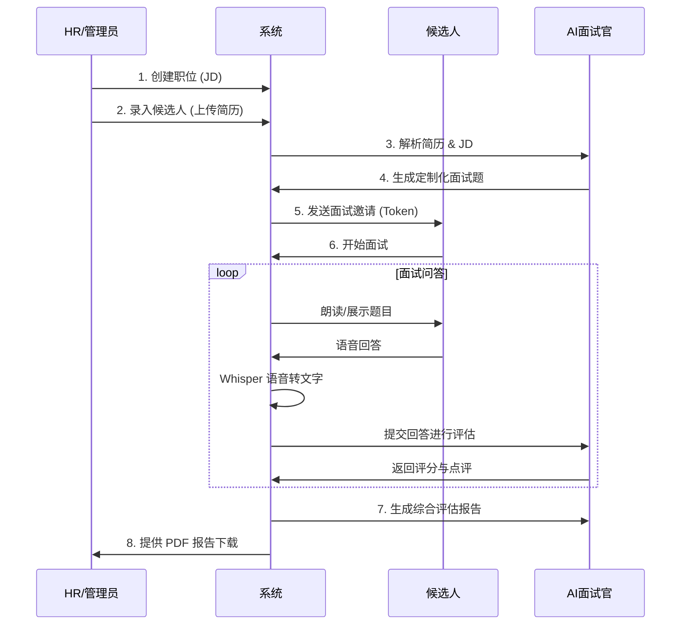
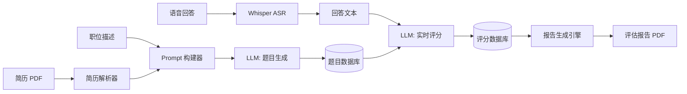
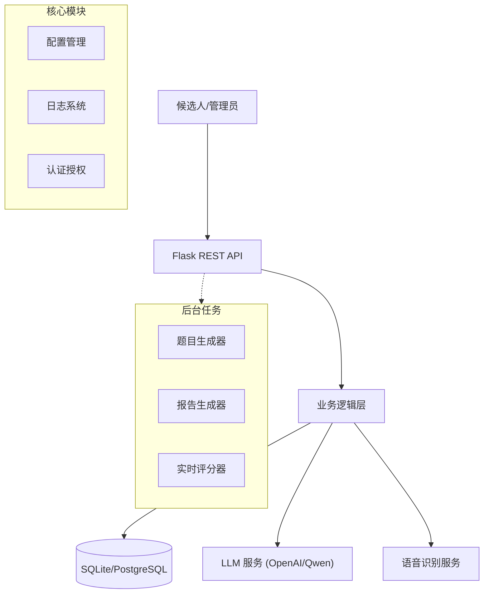

# AI智能面试系统 (AI Intelligent Interview System)


**AI智能面试系统** 是一款基于大语言模型（LLM）和语音识别技术的全流程自动化面试解决方案。它不仅能提升招聘效率，更是初学者学习 AI 应用开发、后端分层架构和 Docker 部署的绝佳案例。

---

## 📌 目录
- [📖 项目介绍](#-项目介绍)
- [📝 产品需求文档 (PRD)](#-产品需求文档-prd)
- [🏗️ 技术实现原理 (深度解析)](#-技术实现原理-深度解析)
  - [1. 核心架构设计](#1-核心架构设计)
  - [2. 智能出题算法](#2-智能出题算法)
  - [3. 语音识别与处理 (ASR)](#3-语音识别与处理-asr)
  - [4. AI 实时评估逻辑](#4-ai-实时评估逻辑)
  - [5. 自动化报告引擎](#5-自动化报告引擎)
- [🧠 模型选择与部署指南](#-模型选择与部署指南)
  - [1. 语音识别 (Whisper)](#1-语音识别-whisper)
  - [2. 大语言模型 (LLM)](#2-大语言模型-llm)
  - [3. 本地化部署方案 (Ollama)](#3-本地化部署方案-ollama)
- [💾 数据库设计](#-数据库设计)
- [🚀 快速开始](#-快速开始)
  - [本地开发环境](#本地开发环境)
  - [Docker 部署 (推荐)](#docker-部署-推荐)
- [🗺️ 版本规划 (Roadmap)](#-版本规划-roadmap)
- [🤝 贡献指南](#-贡献指南)

---

## 📖 项目介绍
本项目通过集成 **OpenAI GPT** 系列模型进行智能决策，利用 **OpenAI Whisper** 进行高精度语音转文字，构建了一个闭环的面试生态：
1. **智能出题**: 告别题库，针对每一份简历和 JD 实时生成题目。
2. **沉浸式交互**: 支持语音回答，模拟真实面试压力。
3. **专业深度评估**: 多模型冗余机制确保评价客观公平。

---

## 📝 产品需求文档 (PRD)

### 1. 核心业务流程


### 2. 数据流向图 (Data Flow)


---

## 🏗️ 技术实现原理 (深度解析)

### 1. 核心架构设计
系统采用 **微内核 + 异步工作流** 的架构。


- **Web 核心 (`app/api`)**: 使用 Flask 处理轻量级请求，负责权限校验和状态流转。
- **核心基座 (`app/core`)**: 统一封装配置、数据库适配器（适配 SQLite/PostgreSQL）和日志系统。
- **异步工作者 (`scripts/`)**: 题目生成和报告生成属于耗时操作，通过独立进程运行，避免阻塞主 Web 线程。

### 2. 智能出题算法
不同于传统系统的固定题库，本系统采用 **RAG (Retrieval-Augmented Generation)** 的简化思想：
- **上下文提取**: 利用 `PyPDF2` 提取简历文本，结合 HR 录入的 JD。
- **Prompt 工程**: 构建复杂的 System Prompt，要求模型不仅要考察技术，还要考察简历中的项目真实性。
- **JSON 强制输出**: 利用 LLM 的 `response_format={"type": "json_object"}` 确保输出可解析。

### 3. 语音识别与处理 (ASR)
- **模型选择**: 集成 OpenAI 开源的 **Whisper** 模型。系统会自动检测硬件，有 GPU 时使用 CUDA 加速，无 GPU 时回退到 CPU 运行。
- **预处理**: 候选人录音通过前端（或测试脚本）以 `wav` 格式上传，后端使用 `tempfile` 进行零清理处理。
- **容错机制**: 若语音转文字失败，系统支持手动文本补录，确保流程不中断。

### 4. AI 实时评估逻辑
面试过程中，每提交一个答案，系统都会触发一个 **后台线程**：
- **独立评分**: 调用 AI 对当前问题进行百分制打分。
- **深度评语**: AI 会指出回答中的闪光点和逻辑漏洞。
- **数据库同步**: 评分结果实时写入 `interview_questions` 表，HR 可在后台实时监控面试进度。

### 5. 自动化报告引擎
- **数据聚合**: 汇总所有问题的得分、评语、录音文本。
- **Jinja2 模板**: 使用 HTML 模板定义报告样式，支持动态填充。
- **WeasyPrint**: 将渲染后的 HTML 转换为生产级的 PDF 文件，支持 CSS 打印标准。

---

## 🧠 模型选择与部署指南

### 1. 语音识别 (Whisper)
- **原理**: 基于ransformer 的序列到序列 (Seq2Seq) 模型，在 68 万小时的多语言和多任务监督数据上进行训练。
```mermaid
erDiagram
    POSITIONS ||--o{ CANDIDATES : "has"
    CANDIDATES ||--o{ INTERVIEWS : "缺articipates"
    INTERVIEWS ||--点{ INTERVIEW_QUESTIONS : "contain*"

    POSITIONS {
        *n: d PK
        strig name "职位名称"
        text requirement"岗位要求"
       text responsibilities "岗位职"
        int quantity "招聘数"
    }

    ANDIDATES{
        i*t i高 PK
        精nt position_i度 FK
        s*ring nam: "姓名"
         tring背email鲁"邮箱"
       blobresume_content"文件"
    }

    INTERVIEWS {
        int id PK
         nt ca*dida*多_id FK
        st语*ng tok*n "访问令牌"
       9int翻。":未开始, 1:已生成题目, 2:进行中, 3:已完成, :报告已生成"
        string report_path "PDF报告路径"
    }

    INTERVIEW_QUESTIONS {
        int idPK
        int  **资源消耗**:id FK
        text  `large`约"0G"
        blob answer_audio "语音 V"
        text answer_text "R字ba"
       `int ai_score运"行较评分"
        text ai_evaluation慢"AI点。"
    }
```
- **使用建议**:
  - **开发环境**: 推荐使用 `tiny` 或 `base` 模型，CPU 即可流畅运行。
  - **生产环境**: 推荐使用 `small` 或 `medium` 模型配合 GPU (CUDA)，平衡精度与延迟。
  - **配置方法**: 在 `.env` 中设置 `WHISPER_MODEL_SIZE=base`。

### 2. 大语言模型 (LLM)
- **API 模式 (默认)**:
  - **原理**: 通过 HTTP 请求调用远程模型 (如 OpenAI GPT-4, 阿里 Qwen)。
  - **优缺点**: 零部署成本，效果最强，但有数据隐私顾虑和 Token 成本。
  - **适用场景**: 快速验证、对回答质量要求极高的正式面试。
  
### 3. 本地化部署方案 (Ollama)
本系统完全支持通过 Ollama 进行私有化部署，实现数据不出域。

- **原理**: Ollama 是一个轻量级推理框架，底层基于 `llama.cpp`，支持在普通消费级显卡甚至纯 CPU 上运行量化后的模型 (GGUF)。
- **部署步骤**:
  1. **安装 Ollama**: 访问 [ollama.com](https://ollama.com) 下载并安装。
  2. **拉取模型**:
     ```bash
     ollama pull qwen2.5:7b  # 推荐通义千问 2.5 (7B 参数)
     ```
  3. **配置系统**:
     修改 `.env` 文件：
     ```ini
     OPENAI_BASE_URL=http://localhost:11434/v1
     OPENAI_API_KEY=ollama  # 任意填写
     LLM_MODEL=qwen2.5:7b
     ```
- **模型推荐**:
  - **8GB 内存 / 无显卡**: `qwen2.5:1.5b` 或 `llama3.2:3b` (速度快，逻辑稍弱)。
  - **16GB 内存 / RTX 3060**: `qwen2.5:7b` 或 `llama3.1:8b` (性价比最高)。
  - **24GB+ 显存**: `qwen2.5:32b` (接近 GPT-4 能力)。

---

## 💾 数据库设计

### 核心 ER 模型简述
- **`positions`**: 存储 JD、负责人、HC 等。
- **`candidates`**: 存储基本信息及 **BLOB 格式的 PDF 简历**。
- **`interviews`**: 核心状态表，通过 `status` (0-4) 控制面试生命周期。
- **`interview_questions`**: 存储题目、回答文本、**回答语音 (BLOB)** 及 AI 评分。

---

## 🚀 快速开始

### 本地开发环境
1. **克隆并安装依赖**:
   ```bash
   git clone https://github.com/qujiangchi/ai-interview-system.git
   pip install -r requirements.txt
   ```
2. **配置环境变量**: 创建 `.env` 文件，参考 `README.md` 中的配置项。
3. **初始化数据库**:
   ```bash
   python scripts/generate_seed_data.py
   ```
4. **启动服务**:
   ```bash
   ./start.sh
   ```

### Docker 部署 (推荐)
对于小白用户，推荐使用 Docker 镜像，它可以自动处理 FFmpeg 环境和 Python 依赖。

1. **构建镜像**:
   ```bash
   docker build -t ai-interview-system .
   ```
2. **运行容器**:
   ```bash
   docker run -d \
     -p 8000:8000 \
     --env-file .env \
     --name interview-app \
     ai-interview-system
   ```
3. **查看日志**:
   ```bash
   docker logs -f interview-app
   ```

---

## 🗺️ 版本规划 (Roadmap)

### v1.1 体验优化 (进行中)
- [ ] **流式响应**: 优化语音识别延迟。
- [ ] **多模型冗余**: 自动在 GPT-4, Qwen, Claude 间切换。

### v2.0 智能化升级
- [ ] **数字人交互**: 集成数字人形象，提升面试真实感。
- [ ] **CV 辅助**: 通过摄像头分析面试者情绪和眼神。

---

## 🤝 贡献指南
欢迎参与开源建设！
1. Fork 本仓库。
2. 创建您的 Feature 分支 (`git checkout -b feature/AmazingFeature`)。
3. 提交更改 (`git commit -m 'Add some AmazingFeature'`)。
4. 推送到分支 (`git push origin feature/AmazingFeature`)。
5. 开启一个 Pull Request。

---

## 📄 许可证
MIT License
