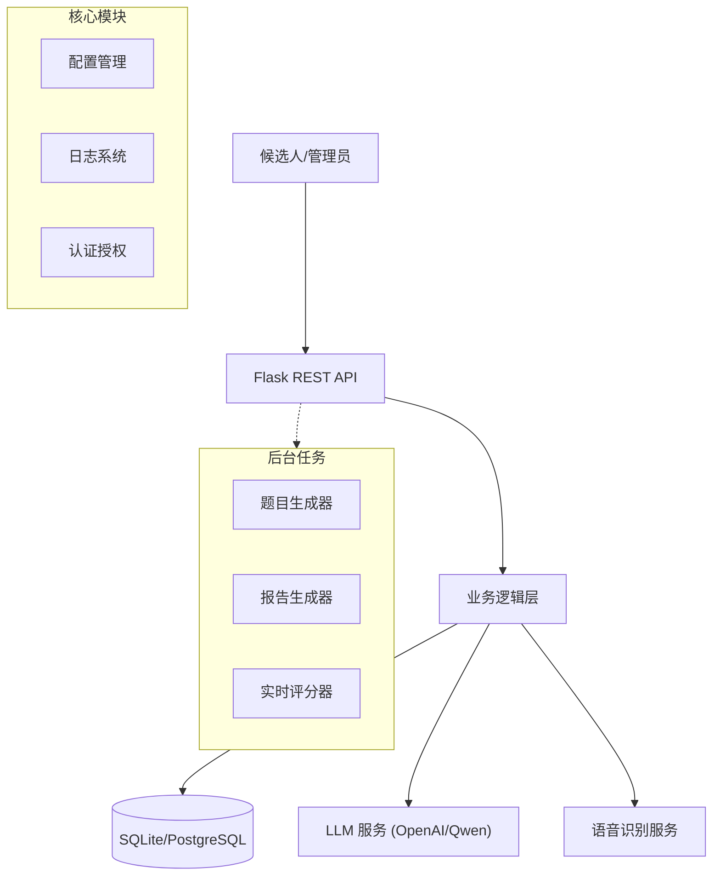

# AI智能面试系统 (AI Intelligent Interview System)


## 📖 项目介绍 (Introduction)

**AI智能面试系统** 是一款基于大语言模型（LLM）和语音识别技术的全流程自动化面试解决方案。旨在帮助企业降低招聘成本、提高面试效率，并为候选人提供公平、专业的面试体验。

系统覆盖了从职位发布、候选人管理、自动化生成面试题目、语音交互面试、实时评分到最终生成详细评估报告的全过程。

### ✨ 核心功能 (Core Features)

*   **智能出题**: 根据职位描述（JD）和候选人简历，利用 LLM 自动生成针对性的技术面试题。
*   **语音交互**: 集成 OpenAI Whisper 模型，支持候选人语音回答，提供真实的面试体验。
*   **实时评估**: AI 面试官对候选人的回答进行实时分析和打分，提供多维度的反馈。
*   **专业报告**: 面试结束后自动生成 PDF 评估报告，包含技术能力、沟通能力、综合素质等多维雷达图及录用建议。
*   **全流程管理**: 提供完善的后台管理系统，管理职位、候选人和面试流程。

## 🏗️ 系统架构 (Architecture)

系统采用分层架构设计，确保代码的可维护性和扩展性。



### 目录结构

```text
/root/project-interview/
├── app/                      # 核心应用包
│   ├── api/                  # API 接口 (Admin, Auth, Interview)
│   ├── core/                 # 核心配置 (Config, Database, Logger)
│   ├── services/             # 业务逻辑 (Report Service)
│   ├── utils/                # 工具函数
│   └── server.py             # 应用入口
├── scripts/                  # 运维与任务脚本
│   ├── generate_seed_data.py # 数据生成脚本
│   └── ...
├── data/                     # 数据存储 (DB, Resumes)
├── reports/                  # 生成的面试报告
├── tests/                    # 测试代码
└── README.md                 # 项目文档
```

## 🚀 快速开始 (Quick Start)

### 环境要求

*   Python 3.8+
*   FFmpeg (用于语音处理)
*   OpenAI API Key (或兼容的 API Key)

### 安装步骤

1.  **克隆仓库**
    ```bash
    git clone https://github.com/yourusername/ai-interview-system.git
    cd ai-interview-system
    ```

2.  **安装依赖**
    ```bash
    pip install -r requirements.txt
    ```

3.  **配置环境**
    复制 `.env.example` 为 `.env` 并填入配置：
    ```ini
    OPENAI_API_KEY=sk-xxxxxxxx
    OPENAI_BASE_URL=https://dashscope.aliyuncs.com/compatible-mode/v1
    SECRET_KEY=your-secret-key
    ```

4.  **初始化数据**
    ```bash
    # 生成测试数据（职位、候选人、简历）
    python scripts/generate_seed_data.py
    ```

5.  **启动服务**
    ```bash
    ./start.sh
    ```
    服务将运行在 `http://localhost:8000`。

## 🧪 测试与验证 (Testing)

运行端到端集成测试，验证完整业务流程：

```bash
python tests/test_flow.py
```

## 🗺️ 下一步计划 (Roadmap)
### Phase 1: 体验增强 (Current)
- [x] 核心面试流程闭环
- [x] PDF 报告生成
- [ ] 优化语音识别延迟
- [ ] 支持更多 LLM 模型 (Claude, Llama 3)

### Phase 2: 功能扩展 (Next)
- [ ] **视频面试分析**: 引入计算机视觉 (CV) 技术，分析候选人表情、眼神接触等非语言行为。
- [ ] **数字人面试官**: 集成 Live2D 或 3D 数字人，提供具象化的面试官形象，支持唇形同步。
- [ ] **多语言支持**: 支持英文、日文等跨语言面试。
- [ ] **代码在线考核**: 集成在线 IDE，支持编程题实时运行和判题。

### Phase 3: 企业级特性 (Future)
- [ ] **微服务架构**: 将核心服务拆分为独立微服务 (Auth, Interview, Report)。
- [ ] **多租户支持**: 支持 SaaS 模式，服务多个企业客户。
- [ ] **数据分析看板**: 提供招聘漏斗、人才画像等数据可视化功能。

## 🤝 贡献指南 (Contributing)

欢迎提交 Issue 和 PR！请确保代码符合 PEP 8 规范，并包含适当的测试和注释。

## 📄 许可证 (License)

MIT License
